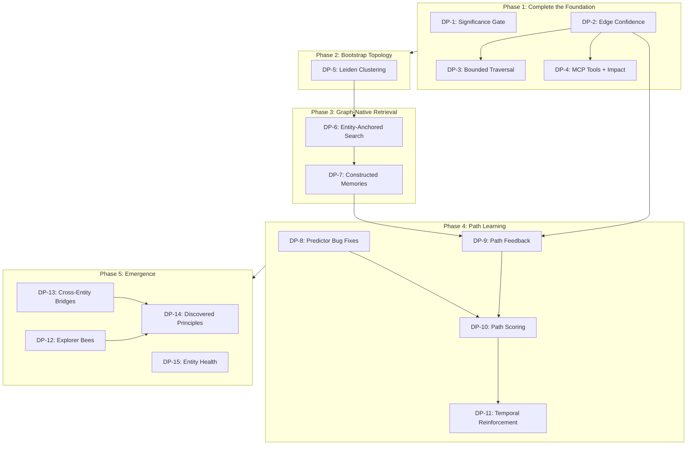

# Epic: Graph-Native Memory Retrieval

*From flat retrieval to learned traversal.*

This epic unifies four documents into an incremental build plan:

- `docs/specs/planning/DESIRE-PATHS.md` — the vision
- `docs/specs/planning/LCM-PATTERNS.md` — five foundation patterns
- `docs/KNOWLEDGE-GRAPH.md` — current implementation
- `docs/research/technical/RESEARCH-GITNEXUS-PATTERNS.md` — bootstrapping techniques

Hard dependencies on existing specs:
- `knowledge-architecture-schema` (KA-1 through KA-6) — COMPLETE
- `predictive-memory-scorer` — COMPLETE (bugs pending)
- `memory-pipeline-v2` — COMPLETE

---

## Already Implemented

These LCM foundation patterns and infrastructure pieces are built and
running. They are not stories — they are the floor this epic stands on.

| Component | Status | Location |
|-----------|--------|----------|
| Three-Level Extraction Escalation | COMPLETE | `pipeline/extraction-escalation.ts` — all 3 levels, thresholds, prompts, orchestrator |
| Lossless Retention (Cold Tier) | COMPLETE | Migration 028, `archiveToCold()` in retention-worker, `/api/repair/cold-stats` endpoint |
| On-Demand Expansion (HTTP) | COMPLETE | `/api/knowledge/expand` endpoint with auth, aspect filtering, scoped traversal |
| Session Summary DAG (schema) | COMPLETE | Migration 029 (`session_summaries`, junction tables), `summary-condensation.ts` (arc/epoch with depth-aware prompts) |
| Backfill Skipped Sessions | COMPLETE | `/api/repair/backfill-skipped` endpoint |
| Graph Traversal | COMPLETE | `graph-traversal.ts` — focal entity resolution, walk algorithm, timeout, constraint surfacing |
| Behavioral Feedback Loop | COMPLETE | `aspect-feedback.ts` — FTS overlap feedback, aspect weight decay, telemetry |
| Entity Pinning | COMPLETE | Migration 022, pin/unpin, always-focal during traversal |
| Relations Confidence | COMPLETE | Migration 005, `relations.confidence` column |

---

## Phase 1: Complete the Foundation

*Finish the partially-built pieces and close remaining gaps in the
signal-cleaning pipeline.*

### DP-1: Significance Gate

**Goal:** Skip extraction entirely for sessions that have nothing worth
remembering. Zero-cost continuity.

**What exists:** The `/api/repair/backfill-skipped` endpoint exists for
retroactive processing. But there is no `significanceGate()` function
at the pipeline entry point — extraction still runs on every session
regardless of content significance.

**What to build:**

1. Create `packages/daemon/src/pipeline/significance-gate.ts` with
   `significanceGate()` function.
2. Gate checks three signals:
   - **Turn count**: fewer than `minTurns` (default 5) substantive
     turns. "Substantive" = user message longer than a greeting,
     assistant response more than acknowledgment.
   - **Entity mention density**: zero FTS matches against existing
     high-importance entities.
   - **Content novelty**: session embedding within `noveltyThreshold`
     distance of recent session embeddings.
3. Call from `worker.ts` after session transcript is received, before
   extraction. If all three checks indicate low significance, emit
   `session_skipped` telemetry event and return.
4. Raw transcript still persisted (lossless retention applies).

**Config additions** (in `PipelineV2Config`):
- `pipeline.minTurns` (default 5)
- `pipeline.minEntityOverlap` (default 1)
- `pipeline.noveltyThreshold` (default 0.15)

**Files:**
- `packages/daemon/src/pipeline/significance-gate.ts` — new module
- `packages/daemon/src/pipeline/worker.ts` — call gate before extraction
- `packages/core/src/types.ts` — config additions
- `packages/daemon/src/memory-config.ts` — wire defaults

**Estimate:** 1-2 days.

---

### DP-2: Edge Confidence and Reason on Dependencies

**Goal:** Add confidence scoring and provenance tracking to
`entity_dependencies` so traversal can prefer trustworthy connections.

**What exists:** The `relations` table already has `confidence` (migration
005). But `entity_dependencies` — the table that graph traversal actually
uses for one-hop expansion — has only `strength` with no confidence
score or provenance. All dependency edges are treated equally regardless
of discovery method.

**What to build:**

1. Migration: add `confidence REAL DEFAULT 0.7` and
   `reason TEXT DEFAULT 'single-memory'` to `entity_dependencies`.
2. Reason enum values and default confidence:
   - `user-asserted` (1.0) — explicitly created or confirmed
   - `multi-memory` (0.9) — extracted from 2+ independent memories
   - `single-memory` (0.7) — extracted once (default)
   - `pattern-matched` (0.5) — heuristic detection
   - `inferred` (0.4) — transitive closure or clustering
   - `llm-uncertain` (0.3) — LLM hedged or low-signal
3. Wire extraction escalation levels into confidence assignment:
   Level 1 = 0.7, Level 2 = 0.5, Level 3 = 0.3 (the escalation code
   exists but doesn't yet set dependency confidence).
4. Update `graph-traversal.ts`: edge filtering uses
   `confidence * strength` instead of `strength` alone for the
   `minDependencyStrength` check.
5. Update `upsertDependency` in `knowledge-graph.ts` to accept and
   persist confidence/reason.

**Files:**
- `packages/core/src/migrations/` — new migration
- `packages/daemon/src/pipeline/graph-transactions.ts` — assign confidence
- `packages/daemon/src/pipeline/graph-traversal.ts` — weighted filtering
- `packages/daemon/src/pipeline/knowledge-graph.ts` — upsertDependency

**Estimate:** 1-2 days.

---

### DP-3: Bounded Traversal Parameters

**Goal:** Tighten traversal bounds to prevent runaway walks in the
43k-entity graph.

**What exists:** `TraversalConfig` has `maxDependencyHops` (30),
`maxAspectsPerEntity` (10), `maxAttributesPerAspect` (20),
`minDependencyStrength` (0.3), `timeoutMs` (500), `aspectFilter`.
Missing: max branching factor per node, total path budget, minimum
path length, confidence floor.

**What to build:**

1. Add to `TraversalConfig`:
   - `maxBranching` (default 4) — at each entity, follow at most N
     outgoing edges (sorted by `confidence * strength` descending)
   - `maxTraversalPaths` (default 50) — total candidate paths
   - `minConfidence` (default 0.5) — filter edges below confidence
     before traversal starts (requires DP-2)
2. Enforce in `graph-traversal.ts` walk algorithm.
3. Reduce `maxDependencyHops` default from 30 to 10.

**Files:**
- `packages/daemon/src/pipeline/graph-traversal.ts` — config + enforcement

**Estimate:** Half day.

---

### DP-4: Expand and Impact MCP Tools

**Goal:** Register the existing expansion endpoint as an MCP tool and
add blast radius analysis.

**What exists:** `/api/knowledge/expand` endpoint works. But it is not
registered as an MCP tool, so agents without HTTP access can't use it.
No blast radius / impact analysis endpoint exists.

**What to build:**

1. Register `knowledge_expand` as MCP tool in `mcp-server.ts` with
   params: entity, aspect (optional), question (optional), maxTokens.
2. Register `knowledge_expand_session` MCP tool for temporal
   drill-down into session summary DAG (tables exist from migration 029).
3. Add `/api/graph/impact` endpoint for blast radius analysis:
   ```
   POST /api/graph/impact
   { "entityId": "...", "direction": "upstream", "minConfidence": 0.7, "maxDepth": 3 }
   ```
   Groups by depth: WILL BREAK, LIKELY AFFECTED, MAY NEED TESTING.
   Requires DP-2 for confidence filtering.
4. Add tool descriptions to connector-generated CLAUDE.md/AGENTS.md.

**Files:**
- `packages/daemon/src/mcp-server.ts` — tool registration
- `packages/daemon/src/daemon.ts` — impact endpoint
- `packages/daemon/src/pipeline/graph-traversal.ts` — upstream walk
- Connector packages — generated instruction updates

**Estimate:** 1-2 days.

---


## Phase 2: Bootstrap Topology

*Give the graph navigable structure before behavioral feedback
accumulates.*

Depends on: Phase 1 (edges have confidence, traversal is bounded).

### DP-5: Leiden Community Detection

**Goal:** Cluster the entity graph into functional neighborhoods.
Give the scorer routing landmarks.

**What exists:** No clustering. All entities are structurally
equidistant.

**What to build:**

1. Install `graphology` + `graphology-communities-leiden` (MIT-licensed).
2. Build graphology graph from `entity_dependencies` +
   `memory_entity_mentions` tables.
3. Run Leiden with `resolution: 1.0`, `randomness: 0.01`.
4. Migration: create `entity_communities` table (id, name, cohesion,
   member_count, created_at, updated_at). Add `community_id` column
   to `entities`.
5. `/api/repair/cluster-entities` endpoint to trigger reclustering.
6. `/api/knowledge/communities` endpoint for dashboard.
7. Surface communities in constellation view as labeled clusters.
8. Global modularity metric (< 0.3 fragmented, > 0.6 strong) via
   `/api/diagnostics/graph`.

**Files:**
- `packages/core/src/migrations/` — new migration
- `packages/daemon/src/pipeline/community-detection.ts` — new module
- `packages/daemon/src/daemon.ts` — endpoints
- `packages/daemon/src/diagnostics.ts` — modularity metric
- Dashboard: constellation overlay changes

**Estimate:** 2-3 days.

---


## Phase 3: Graph-Native Retrieval

*Change how retrieval works. Search finds the door; the graph walk
goes through it.*

Depends on: Phase 2 (topology exists to traverse). DP-7 depends on
DP-6.

### DP-6: Entity-Anchored Search

**Goal:** Hybrid search identifies *entities*, not memories.

**What exists:** `resolveFocalEntities` in `graph-traversal.ts` uses
project path matching, query token matching via LIKE queries, checkpoint
entities, and pinned entities. This is heuristic-based — it matches
path components and normalized tokens against entity names. It does not
use FTS5 or embeddings to find entities, and cannot rank entity
relevance by structural signals.

**What to build:**

1. Add entity-resolution via FTS5 + embedding search against `entities`
   (in addition to `memories`).
2. Score entity matches by: name match strength, mention count,
   community membership (DP-5), pinned status, structural density.
3. Return ranked focal entities. The current heuristic resolution
   becomes fallback for when entity-anchored search produces no results.
4. Flat memory search still runs as secondary channel — merged with
   traversal results during reranking. But graph walk is now the
   primary retrieval path.

**Files:**
- `packages/daemon/src/pipeline/graph-traversal.ts` — new resolution path
- `packages/core/src/search.ts` — entity search additions

**Estimate:** 2-3 days.

---

### DP-7: Constructed Memories

**Goal:** Synthesize purpose-built context from traversal paths instead
of returning raw memory rows.

**What exists:** Traversal collects `memoryIds` and the calling code
fetches those memory rows verbatim. The agent receives N individual
memories, some of which are fragments missing surrounding context.

**What to build:**

1. After traversal walks entity→aspect→attribute chains, synthesize
   each path into a constructed context block combining attributes,
   constraints, and dependency relationships.
2. Template-based construction (no LLM call): entity name, aspect
   names, attribute values, relationships — formatted as a coherent
   block.
3. Result: fewer, denser, purpose-built context blocks instead of
   15 individual memories where 7 are noise.
4. Provenance metadata: which entities, aspects, and attributes were
   combined. Required for path feedback propagation (DP-9).

**Files:**
- `packages/daemon/src/pipeline/context-construction.ts` — new module
- `packages/daemon/src/pipeline/graph-traversal.ts` — return path
  structure, not just memoryIds
- `packages/daemon/src/pipeline/worker.ts` — use constructed context

**Estimate:** 2-3 days.

---


## Phase 4: Path Learning

*The predictor evolves from a memory ranker to a path scorer. Feedback
reinforces traversal routes, not individual memories.*

Depends on: Phase 3 (graph-native retrieval produces paths to score).

### DP-8: Predictor Bug Fixes

**Goal:** Fix the three critical bugs blocking predictor enablement.

**What exists:** All 4 scorer sprints complete. Three bugs from Greptile
review: (1) feature vectors 4-element but sidecar expects 17 (silent
failure), (2) cold start exits early on training pair count instead of
session count, (3) stale traversal cache never invalidated. Scorer is
disabled by default (safe).

**What to build:**

1. Fix feature vector dimension mismatch.
2. Fix cold start logic (check session count, not pair count).
3. Add cache invalidation for traversal state after graph mutations.
4. Enable scorer and verify it produces meaningful rankings.

**Files:**
- `predictor/` — Rust crate fixes
- `packages/daemon/src/pipeline/graph-traversal.ts` — cache invalidation

**Estimate:** 1-2 days.

---

### DP-9: Path Feedback Propagation

**Goal:** When the agent rates injected context, the rating propagates
to the traversal path that produced it.

**What exists:** `aspect-feedback.ts` adjusts aspect weights based on
FTS overlap — a coarse signal that confirms aspects but doesn't know
which paths through those aspects were useful.

**What to build:**

1. Tag injected context blocks with the path that produced them
   (provenance from DP-7).
2. When context is rated:
   - Positive: reinforce every edge (increase confidence + strength)
     and every aspect (increase weight) along the path.
   - Negative: weaken path edges. Not catastrophically — accumulated
     negative signal causes deprioritization.
   - Neutral/unused: no signal.
3. Confidence upgrade/downgrade: positive → `pattern-matched` to
   `multi-memory`; negative → `single-memory` to `llm-uncertain`.
   (Requires DP-2 for confidence/reason columns.)
4. Store path feedback history for scorer training data.
5. Integrate with existing FTS overlap feedback as complementary signal.

**Files:**
- `packages/daemon/src/pipeline/aspect-feedback.ts` — path-level feedback
- `packages/daemon/src/pipeline/graph-transactions.ts` — edge updates
- `packages/daemon/src/pipeline/knowledge-graph.ts` — confidence updates

**Estimate:** 2-3 days.

---

### DP-10: Path Scoring (Predictor Evolution)

**Goal:** The predictor ranks traversal paths, not individual memories.

**What exists:** The predictor scores individual memories. Its feature
vector includes temporal, structural, and behavioral signals per memory.

**What to build:**

1. Define `TraversalPath` type: ordered sequence of
   (entity_id, aspect_id, attribute_id, dependency_edge_id) hops.
2. Compute path-level features:
   - Path length (hop count)
   - Minimum edge confidence along the path
   - Average aspect weight along the path
   - Whether path crosses community boundary (DP-5)
   - Temporal features (recency of attributes along path)
   - Historical feedback score for this path pattern (DP-9)
3. Scorer ranks paths. Top-K paths are walked and their traversal
   results are constructed (DP-7).
4. Training signal changes from "was this memory useful?" to "was this
   traversal path useful?"

Depends on: DP-8 (predictor bugs fixed), DP-9 (path feedback provides
training data).

**Files:**
- `predictor/` — Rust crate: path features
- `packages/daemon/src/pipeline/graph-traversal.ts` — emit path objects
- `packages/daemon/src/pipeline/worker.ts` — scorer integration

**Estimate:** 3-5 days.

---

### DP-11: Temporal Reinforcement

**Goal:** The scorer learns temporal patterns — which paths matter at
which times.

**What exists:** The predictor has temporal features (session time, day
of week, recency) but applies them to flat memories, not paths.

**What to build:**

1. Add temporal features to path scoring:
   - Time of day when path was last traversed successfully
   - Day of week pattern strength
   - Session gap since last successful traversal
2. Pre-warming: if temporal features predict a path will be needed,
   pre-traverse at session start before any query arrives.
3. Temporal decay: paths not traversed in N days fade in temporal
   relevance (distinct from structural aspect decay).

Depends on: DP-10 (path scoring).

**Files:**
- `predictor/` — temporal path features
- `packages/daemon/src/pipeline/graph-traversal.ts` — pre-warming
- `packages/daemon/src/pipeline/worker.ts` — session-start pre-traversal

**Estimate:** 2-3 days.

---


## Phase 5: Emergence

*The system discovers connections, avoids local optima, and develops
a health model for its own knowledge.*

Depends on: Phase 4 (path learning provides feedback signals). Stories
are independent of each other.

### DP-12: Explorer Bees

**Goal:** Speculative traversals walk unfamiliar paths to discover new
connections. Insurance against local optima.

**What to build:**

1. One explorer traversal per session (configurable). Tagged as
   speculative.
2. Find entities semantically adjacent (close in embedding space) but
   graph-distant (no dependency edges). Walk between them.
3. Positive feedback → promote to real dependency edge. Negative →
   path fades.
4. Staleness detection: same paths every session, no new connections →
   increase exploration frequency. Self-regulating.
5. Explorer bees can access cold tier (migration 028) to surface
   forgotten connections.

**Config:** `exploration.enabled`, `exploration.perSessionCount` (1),
`exploration.stalenessThreshold` (10).

**Files:**
- `packages/daemon/src/pipeline/explorer.ts` — new module
- `packages/daemon/src/pipeline/worker.ts` — integrate at session start
- `packages/core/src/types.ts` — config additions

**Estimate:** 2-3 days.

---

### DP-13: Cross-Entity Boundary Traversal

**Goal:** Discover that things known in different contexts are the same
thing. The dedup mechanism that prevents redundancy also discovers
connections.

**What to build:**

1. During extraction, after dedup, add: "does this fact bridge to an
   entity it isn't currently linked to?"
2. When an extracted attribute is semantically similar to an existing
   attribute on a different entity (embedding distance below threshold),
   propose a cross-entity dependency edge.
3. New edges start with low confidence (`inferred`, 0.4), upgradeable
   by feedback (DP-9).

**Files:**
- `packages/daemon/src/pipeline/worker.ts` — post-dedup bridge check
- `packages/daemon/src/pipeline/graph-transactions.ts` — bridge edges

**Estimate:** 1-2 days.

---

### DP-14: Discovered Principles

**Goal:** When cross-entity patterns span 3+ unrelated entities, the
system has discovered a principle — a value or recurring pattern that
lives in the space between entities.

**What to build:**

1. Add `principle` to the entity type taxonomy.
2. When cross-entity traversal (DP-13) or explorer bees (DP-12) detect
   a pattern spanning 3+ unrelated entities, propose a principle entity.
3. Principle appears in constellation as distinct shape with edges to
   source entities.
4. Notification: "Signet noticed something." With evidence trail.
5. User can correct, confirm, or reject. Confirmed principles become
   first-class entities influencing path scoring.

Depends on: DP-12 or DP-13 (need cross-entity detection).

**Files:**
- `packages/core/src/types.ts` — `principle` entity type
- `packages/daemon/src/pipeline/principle-detection.ts` — new module
- Dashboard: principle notification component

**Estimate:** 3-4 days.

---

### DP-15: Entity Health Dashboard

**Goal:** Per-entity health from accumulated path feedback. Which
entities earn their keep?

**What to build:**

1. Compute per-entity health score from path feedback history.
2. Surface in dashboard: health heatmap or ranking.
3. Pruning recommendations: persistently negative → restructure/remove.
   High feedback but sparse → enrich.
4. Historical view via cold tier.
5. Replace threshold-based pruning with informed pruning.

**Files:**
- `packages/daemon/src/pipeline/entity-health.ts` — new module
- `packages/daemon/src/diagnostics.ts` — health scoring
- Dashboard: health visualization
- `packages/daemon/src/daemon.ts` — health endpoint

**Estimate:** 2-3 days.

---


## Story Dependency Graph



## Effort Summary

| Phase | Stories | Estimate |
|-------|---------|----------|
| 1: Complete the Foundation | DP-1, DP-2, DP-3, DP-4 | 4-7 days |
| 2: Bootstrap Topology | DP-5 | 2-3 days |
| 3: Graph-Native Retrieval | DP-6, DP-7 | 4-6 days |
| 4: Path Learning | DP-8, DP-9, DP-10, DP-11 | 8-13 days |
| 5: Emergence | DP-12, DP-13, DP-14, DP-15 | 8-12 days |
| **Total** | **15 stories** | **26-41 days** |

With parallelism within phases, critical path is ~18-25 working days.

---

## Relationship to Existing Specs

Extends the system graph in `docs/specs/INDEX.md`:

```
knowledge-architecture-schema (COMPLETE, KA-1 through KA-6)
    → desire-paths-epic (THIS)
        → Phase 1: foundation completion
        → Phase 2-3: topology + graph-native retrieval
        → Phase 4-5: path learning + emergence

predictive-memory-scorer (COMPLETE, bugs pending)
    → DP-8: bug fixes (prerequisite)
    → DP-10: evolves from memory ranker to path scorer
```

The existing KA and LCM foundation work is the floor this epic stands
on. The predictive scorer's evolution to path scoring (DP-10) is the
convergence point described in DESIRE-PATHS.md.

---

*Written by Nicholai and Mr. Claude. March 11, 2026.*
