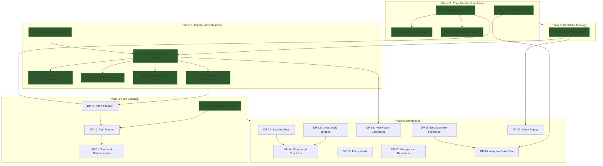

# Epic: Graph-Native Memory Retrieval

*From flat retrieval to learned traversal.*

This epic unifies four documents into an incremental build plan:

- `docs/specs/planning/DESIRE-PATHS.md` — the vision
- `docs/specs/planning/LCM-PATTERNS.md` — five foundation patterns
- `docs/KNOWLEDGE-GRAPH.md` — current implementation
- `docs/research/technical/RESEARCH-GITNEXUS-PATTERNS.md` — bootstrapping techniques

Hard dependencies on existing specs:
- `knowledge-architecture-schema` (KA-1 through KA-6) — COMPLETE
- `predictive-memory-scorer` — COMPLETE (bugs pending)
- `memory-pipeline-v2` — COMPLETE

---

## Already Implemented

These LCM foundation patterns and infrastructure pieces are built and
running. They are not stories — they are the floor this epic stands on.

| Component | Status | Location |
|-----------|--------|----------|
| Three-Level Extraction Escalation | COMPLETE | `pipeline/extraction-escalation.ts` — all 3 levels, thresholds, prompts, orchestrator |
| Lossless Retention (Cold Tier) | COMPLETE | Migration 028, `archiveToCold()` in retention-worker, `/api/repair/cold-stats` endpoint |
| On-Demand Expansion (HTTP) | COMPLETE | `/api/knowledge/expand` endpoint with auth, aspect filtering, scoped traversal |
| Session Summary DAG (schema) | COMPLETE | Migration 029 (`session_summaries`, junction tables), `summary-condensation.ts` (arc/epoch with depth-aware prompts) |
| Backfill Skipped Sessions | COMPLETE | `/api/repair/backfill-skipped` endpoint |
| Graph Traversal | COMPLETE | `graph-traversal.ts` — focal entity resolution, walk algorithm, timeout, constraint surfacing |
| Behavioral Feedback Loop | COMPLETE | `aspect-feedback.ts` — FTS overlap feedback, aspect weight decay, telemetry |
| Entity Pinning | COMPLETE | Migration 022, pin/unpin, always-focal during traversal |
| Relations Confidence | COMPLETE | Migration 005, `relations.confidence` column |
| Inline Entity Linking | COMPLETE | `inline-entity-linker.ts` — write-time entity/aspect/attribute derivation (see DP-6a) |
| Traversal-Primary Flow | COMPLETE | `memory-search.ts` — graph walk as primary channel, FTS as gap-fill |
| Mention-Based Traversal Fallback | COMPLETE | `graph-traversal.ts` — `memory_entity_mentions` fallback when `entity_attributes` empty |
| Community Detection (Louvain) | COMPLETE | `community-detection.ts` — Louvain clustering, `entity_communities` table |

---

## Benchmark Findings (E15–E23, March 2026)

*20 experiments on LoCoMo 50-question benchmark. Key learnings that
shaped the implementation decisions below.*

**Fair baseline (E23):** Signet 62% vs RAG 68% on identical 50 questions.
Prior invalid comparison (different question sets) showed 54% vs 66%.

| Finding | Evidence | Implication |
|---------|----------|-------------|
| Traversal was a no-op | E15-E20: 0 traversal candidates | Without write-time structure, `entity_attributes` pointed at wrong scopes |
| Write-time structure is required | DP-6a fix → entity/aspect/attribute at remember-time | Pipeline extraction is too late — remember endpoint must derive KA structure |
| Vector search is irrelevant for scoped queries | E20b = E15 (identical 54%) | sqlite-vec can't pre-filter scope; already skipped |
| Constructed memories are critical | E16: removing them → 42% | Never remove, only improve |
| OR-everywhere hurts precision | E21: gained single-hop, lost multi-hop/adversarial (net -2%) | AND for short queries, OR for long |
| Prompt tuning hits ceiling fast | E9, E13, E19 all regressed | Retrieval quality is the bottleneck |
| 8/12 Signet failures shared with RAG | E15 failure analysis | Extraction/answer ceiling, not retrieval-specific |
| Data variance confounds results | E20 fresh data: 34%; E20b same data: 54% | Always reuse `dataSourceRunId` |

**Known issue:** Benchmark data mixes with real memories. Scope filtering
at hydration prevents cross-contamination in results, but the entity
graph accumulates benchmark entities alongside real ones.

---

## Phase 1: Complete the Foundation -- COMPLETE

*Finish the partially-built pieces and close remaining gaps in the
signal-cleaning pipeline.*

### DP-1: Significance Gate

**Goal:** Skip extraction entirely for sessions that have nothing worth
remembering. Zero-cost continuity.

**What exists:** The `/api/repair/backfill-skipped` endpoint exists for
retroactive processing. But there is no `significanceGate()` function
at the pipeline entry point — extraction still runs on every session
regardless of content significance.

**What to build:**

1. Create `packages/daemon/src/pipeline/significance-gate.ts` with
   `significanceGate()` function.
2. Gate checks three signals:
   - **Turn count**: fewer than `minTurns` (default 5) substantive
     turns. "Substantive" = user message longer than a greeting,
     assistant response more than acknowledgment.
   - **Entity mention density**: zero FTS matches against existing
     high-importance entities.
   - **Content novelty**: session embedding within `noveltyThreshold`
     distance of recent session embeddings.
3. Call from `worker.ts` after session transcript is received, before
   extraction. If all three checks indicate low significance, emit
   `session_skipped` telemetry event and return.
4. Raw transcript still persisted (lossless retention applies).

**Config additions** (in `PipelineV2Config`):
- `pipeline.minTurns` (default 5)
- `pipeline.minEntityOverlap` (default 1)
- `pipeline.noveltyThreshold` (default 0.15)

**Files:**
- `packages/daemon/src/pipeline/significance-gate.ts` — new module
- `packages/daemon/src/pipeline/worker.ts` — call gate before extraction
- `packages/core/src/types.ts` — config additions
- `packages/daemon/src/memory-config.ts` — wire defaults

**Estimate:** 1-2 days.

---

### DP-2: Edge Confidence and Reason on Dependencies

**Goal:** Add confidence scoring and provenance tracking to
`entity_dependencies` so traversal can prefer trustworthy connections.

**What exists:** The `relations` table already has `confidence` (migration
005). But `entity_dependencies` — the table that graph traversal actually
uses for one-hop expansion — has only `strength` with no confidence
score or provenance. All dependency edges are treated equally regardless
of discovery method.

**What to build:**

1. Migration: add `confidence REAL DEFAULT 0.7` and
   `reason TEXT DEFAULT 'single-memory'` to `entity_dependencies`.
2. Reason enum values and default confidence:
   - `user-asserted` (1.0) — explicitly created or confirmed
   - `multi-memory` (0.9) — extracted from 2+ independent memories
   - `single-memory` (0.7) — extracted once (default)
   - `pattern-matched` (0.5) — heuristic detection
   - `inferred` (0.4) — transitive closure or clustering
   - `llm-uncertain` (0.3) — LLM hedged or low-signal
3. Wire extraction escalation levels into confidence assignment:
   Level 1 = 0.7, Level 2 = 0.5, Level 3 = 0.3 (the escalation code
   exists but doesn't yet set dependency confidence).
4. Update `graph-traversal.ts`: edge filtering uses
   `confidence * strength` instead of `strength` alone for the
   `minDependencyStrength` check.
5. Update `upsertDependency` in `knowledge-graph.ts` to accept and
   persist confidence/reason.

**Files:**
- `packages/core/src/migrations/` — new migration
- `packages/daemon/src/pipeline/graph-transactions.ts` — assign confidence
- `packages/daemon/src/pipeline/graph-traversal.ts` — weighted filtering
- `packages/daemon/src/pipeline/knowledge-graph.ts` — upsertDependency

**Estimate:** 1-2 days.

---

### DP-3: Bounded Traversal Parameters

**Goal:** Tighten traversal bounds to prevent runaway walks in the
43k-entity graph.

**What exists:** `TraversalConfig` has `maxDependencyHops` (30),
`maxAspectsPerEntity` (10), `maxAttributesPerAspect` (20),
`minDependencyStrength` (0.3), `timeoutMs` (500), `aspectFilter`.
Missing: max branching factor per node, total path budget, minimum
path length, confidence floor.

**What to build:**

1. Add to `TraversalConfig`:
   - `maxBranching` (default 4) — at each entity, follow at most N
     outgoing edges (sorted by `confidence * strength` descending)
   - `maxTraversalPaths` (default 50) — total candidate paths
   - `minConfidence` (default 0.5) — filter edges below confidence
     before traversal starts (requires DP-2)
2. Enforce in `graph-traversal.ts` walk algorithm.
3. Reduce `maxDependencyHops` default from 30 to 10.

**Files:**
- `packages/daemon/src/pipeline/graph-traversal.ts` — config + enforcement

**Estimate:** Half day.

---

### DP-4: Expand and Impact MCP Tools

**Goal:** Register the existing expansion endpoint as an MCP tool and
add blast radius analysis.

**What exists:** `/api/knowledge/expand` endpoint works. But it is not
registered as an MCP tool, so agents without HTTP access can't use it.
No blast radius / impact analysis endpoint exists.

**What to build:**

1. Register `knowledge_expand` as MCP tool in `mcp-server.ts` with
   params: entity, aspect (optional), question (optional), maxTokens.
2. Register `knowledge_expand_session` MCP tool for temporal
   drill-down into session summary DAG (tables exist from migration 029).
3. Add `/api/graph/impact` endpoint for blast radius analysis:
   ```
   POST /api/graph/impact
   { "entityId": "...", "direction": "upstream", "minConfidence": 0.7, "maxDepth": 3 }
   ```
   Groups by depth: WILL BREAK, LIKELY AFFECTED, MAY NEED TESTING.
   Requires DP-2 for confidence filtering.
4. Add tool descriptions to connector-generated CLAUDE.md/AGENTS.md.

**Files:**
- `packages/daemon/src/mcp-server.ts` — tool registration
- `packages/daemon/src/daemon.ts` — impact endpoint
- `packages/daemon/src/pipeline/graph-traversal.ts` — upstream walk
- Connector packages — generated instruction updates

**Estimate:** 1-2 days.

---


## Phase 2: Bootstrap Topology -- COMPLETE

*Give the graph navigable structure before behavioral feedback
accumulates.*

Depends on: Phase 1 (edges have confidence, traversal is bounded).

### DP-5: Louvain Community Detection — PARTIALLY COMPLETE

**Goal:** Cluster the entity graph into functional neighborhoods.
Give the scorer routing landmarks.

**What exists:** `community-detection.ts` implements Louvain clustering
via graphology. `entity_communities` table exists. `/api/repair/cluster-entities`
endpoint works. Constellation view integration in progress.

**What to build:**

1. Install `graphology` + `graphology-communities-louvain` (MIT-licensed).
2. Build graphology graph from `entity_dependencies` +
   `memory_entity_mentions` tables.
3. Run Louvain with `resolution: 1.0`.
4. Migration: create `entity_communities` table (id, name, cohesion,
   member_count, created_at, updated_at). Add `community_id` column
   to `entities`.
5. `/api/repair/cluster-entities` endpoint to trigger reclustering.
6. `/api/knowledge/communities` endpoint for dashboard.
7. Surface communities in constellation view as labeled clusters.
8. Global modularity metric (< 0.3 fragmented, > 0.6 strong) via
   `/api/diagnostics/graph`.

**Files:**
- `packages/core/src/migrations/` — new migration
- `packages/daemon/src/pipeline/community-detection.ts` — new module
- `packages/daemon/src/daemon.ts` — endpoints
- `packages/daemon/src/diagnostics.ts` — modularity metric
- Dashboard: constellation overlay changes

**Estimate:** 2-3 days.

---


## Phase 3: Graph-Native Retrieval -- COMPLETE

*Change how retrieval works. Search finds the door; the graph walk
goes through it.*

Depends on: Phase 2 (topology exists to traverse). DP-7 depends on
DP-6.

### DP-6: Entity-Anchored Search — PARTIALLY COMPLETE

**Goal:** Hybrid search identifies *entities*, not memories. Graph walk
is the primary retrieval path.

**Status:** Core flow is implemented and benchmarked. Entity-anchored
search via FTS5 against entities is not yet built (the resolution still
uses heuristic token matching). But the architectural inversion —
traversal-primary, flat-gap-fill — is live and producing results.

**What was built (March 2026):**

1. **Traversal-primary flow** in `memory-search.ts`: graph traversal
   runs as Channel A (primary), FTS5 keyword search runs as Channel B
   (gap-fill). Traversal memories scored by structural importance from
   `entity_attributes`. Flat search only contributes memories the
   graph didn't find. Graceful degradation: when entity resolution
   finds no focal entities, Channel B gets full result limit.
2. **FTS5 stop-word filtering** in `graph-search.ts`: shared stop-word
   list prevents common tokens from matching garbage entities.
3. **Mention-based traversal fallback** in `graph-traversal.ts`: when
   `entity_attributes` yields no memories for an entity (e.g., before
   pipeline extraction runs), falls back to `memory_entity_mentions`
   joined with `memories` for scope filtering.
4. **Scope-filtered attribute collection**: traversal joins with
   `memories` table to pre-filter out-of-scope results during
   collection, not after hydration.

**What remains:**

1. Entity-resolution via FTS5 + embedding search against `entities`
   (not just LIKE-based token matching).
2. Entity ranking by structural signals: mention count, community
   membership (DP-5), pinned status, structural density.
3. Current heuristic resolution becomes fallback for when entity-
   anchored search produces no results.

**Files:**
- `packages/daemon/src/memory-search.ts` — traversal-primary flow (DONE)
- `packages/daemon/src/pipeline/graph-search.ts` — stop-word filtering (DONE)
- `packages/daemon/src/pipeline/graph-traversal.ts` — mention fallback, scope filter (DONE)
- `packages/daemon/src/pipeline/graph-traversal.ts` — FTS5 entity resolution (TODO)
- `packages/core/src/search.ts` — entity search additions (TODO)

---

### DP-6a: Inline Entity Linking (Write-Time Structure) — COMPLETE

**Goal:** The `/api/memory/remember` endpoint derives full entity →
aspect → attribute structure from memory content at write time, without
LLM calls. This ensures traversal can find the memory immediately.

**Motivation:** Benchmark experiments (E15-E22) revealed that traversal
produced zero candidates because entity_attributes only existed after
async pipeline extraction — which runs later and may never complete for
scoped/benchmark memories. The remember endpoint must be self-sufficient.

**What was built:**

1. `inline-entity-linker.ts` — new module with:
   - **Aspect inference from verb patterns**: 12 regex patterns mapping
     sentence verbs to aspect categories (preferences, events,
     properties, activities, perspectives, background, relationships,
     decision patterns).
   - **Name extraction**: proper noun detection from capitalized words,
     multi-word name grouping, SKIP_WORDS filter for false positives.
     Includes sentence-initial proper nouns (critical for "Caroline
     attended..." patterns).
   - **Clause extraction**: entity-predicate pairs from sentence
     structure. "Caroline attended an LGBTQ support group" → entity:
     Caroline, aspect: events, predicate: "attended an LGBTQ support
     group."
   - **Entity/aspect/attribute resolution**: find-or-create with
     UNIQUE constraint handling, canonical name normalization, duplicate
     attribute detection via `normalized_content`.
   - **Co-occurrence dependencies**: entities mentioned in the same
     memory get `related_to` dependency edges.
2. `daemon.ts` — remember endpoint calls `linkMemoryToEntities()` inside
   the write transaction, immediately after memory insert.
3. `LinkResult` interface returns counts: `linked`, `created`,
   `entityIds`, `aspects`, `attributes`.

**Key design decisions:**
- No LLM — sentence grammar is sufficient for aspect inference at the
  "this is probably an attribute that needs sorting into an aspect of
  an entity" level.
- Runs synchronously inside the write transaction. KA traversal finds
  the memory immediately.
- Pipeline extraction still runs later for deeper analysis (supersession,
  dependency synthesis, confidence calibration). This is complementary,
  not redundant.

**Files:**
- `packages/daemon/src/inline-entity-linker.ts` — new module (COMPLETE)
- `packages/daemon/src/daemon.ts` — integration at remember endpoint (COMPLETE)

---

### DP-7: Constructed Memories

**Goal:** Synthesize purpose-built context from traversal paths instead
of returning raw memory rows.

**What exists:** Traversal collects `memoryIds` and the calling code
fetches those memory rows verbatim. The agent receives N individual
memories, some of which are fragments missing surrounding context.

**What to build:**

1. After traversal walks entity→aspect→attribute chains, synthesize
   each path into a constructed context block combining attributes,
   constraints, and dependency relationships.
2. Template-based construction (no LLM call): entity name, aspect
   names, attribute values, relationships — formatted as a coherent
   block.
3. Result: fewer, denser, purpose-built context blocks instead of
   15 individual memories where 7 are noise.
4. Provenance metadata: which entities, aspects, and attributes were
   combined. Required for path feedback propagation (DP-9).

**Files:**
- `packages/daemon/src/pipeline/context-construction.ts` — new module
- `packages/daemon/src/pipeline/graph-traversal.ts` — return path
  structure, not just memoryIds
- `packages/daemon/src/pipeline/worker.ts` — use constructed context

**Estimate:** 2-3 days.

---


## Phase 4: Path Learning

*The predictor evolves from a memory ranker to a path scorer. Feedback
reinforces traversal routes, not individual memories.*

Depends on: Phase 3 (graph-native retrieval produces paths to score).

### DP-8: Predictor Bug Fixes

**Goal:** Fix the three critical bugs blocking predictor enablement.

**What exists:** All 4 scorer sprints complete. Three bugs from Greptile
review: (1) feature vectors 4-element but sidecar expects 17 (silent
failure), (2) cold start exits early on training pair count instead of
session count, (3) stale traversal cache never invalidated. Scorer is
disabled by default (safe).

**What to build:**

1. Fix feature vector dimension mismatch.
2. Fix cold start logic (check session count, not pair count).
3. Add cache invalidation for traversal state after graph mutations.
4. Enable scorer and verify it produces meaningful rankings.

**Files:**
- `predictor/` — Rust crate fixes
- `packages/daemon/src/pipeline/graph-traversal.ts` — cache invalidation

**Estimate:** 1-2 days.

---

### DP-9: Path Feedback Propagation

**Goal:** When the agent rates injected context, the rating propagates
to the traversal path that produced it.

**What exists:** `aspect-feedback.ts` adjusts aspect weights based on
FTS overlap — a coarse signal that confirms aspects but doesn't know
which paths through those aspects were useful.

**What to build:**

1. Tag injected context blocks with the path that produced them
   (provenance from DP-7).
2. When context is rated:
   - Positive: reinforce every edge (increase confidence + strength)
     and every aspect (increase weight) along the path.
   - Negative: weaken path edges. Not catastrophically — accumulated
     negative signal causes deprioritization.
   - Neutral/unused: no signal.
3. Confidence upgrade/downgrade: positive → `pattern-matched` to
   `multi-memory`; negative → `single-memory` to `llm-uncertain`.
   (Requires DP-2 for confidence/reason columns.)
4. Store path feedback history for scorer training data.
5. Integrate with existing FTS overlap feedback as complementary signal.
6. **Co-occurrence edge creation (Hebbian growth):** When memories are
   co-retrieved across multiple sessions, create new `entity_dependencies`
   edges between their parent entities. Use NPMI normalization to filter
   noise (co-retrieval must exceed base rate). New edges start at
   confidence `pattern-matched` (0.5). Per-entity homeostasis cap
   prevents hub entities from accumulating unbounded edge weight.
   (Informed by Ori-Mnemos co-occurrence model.)
7. **Q-value reward vocabulary:** Extend feedback beyond binary
   positive/negative. Track reward signals: forward citation (memory
   referenced later in session, +1.0), update after retrieval (memory
   modified after being surfaced, +0.5), downstream creation (new
   memory created referencing retrieved one, +0.6), dead-end (retrieved
   but session ended without engagement, -0.15). Accumulate via EMA
   (alpha=0.1) per path. (Informed by Ori-Mnemos Q-value reranking.)

**Files:**
- `packages/daemon/src/pipeline/aspect-feedback.ts` — path-level feedback
- `packages/daemon/src/pipeline/graph-transactions.ts` — edge updates
- `packages/daemon/src/pipeline/knowledge-graph.ts` — confidence updates

**Estimate:** 3-5 days.

---

### DP-10: Path Scoring (Predictor Evolution)

**Goal:** The predictor ranks traversal paths, not individual memories.

**What exists:** The predictor scores individual memories. Its feature
vector includes temporal, structural, and behavioral signals per memory.

**What to build:**

1. Define `TraversalPath` type: ordered sequence of
   (entity_id, aspect_id, attribute_id, dependency_edge_id) hops.
2. Compute path-level features:
   - Path length (hop count)
   - Minimum edge confidence along the path
   - Average aspect weight along the path
   - Whether path crosses community boundary (DP-5)
   - Temporal features (recency of attributes along path)
   - Historical feedback score for this path pattern (DP-9)
3. Scorer ranks paths. Top-K paths are walked and their traversal
   results are constructed (DP-7).
4. Training signal changes from "was this memory useful?" to "was this
   traversal path useful?"

Depends on: DP-8 (predictor bugs fixed), DP-9 (path feedback provides
training data).

**Files:**
- `predictor/` — Rust crate: path features
- `packages/daemon/src/pipeline/graph-traversal.ts` — emit path objects
- `packages/daemon/src/pipeline/worker.ts` — scorer integration

**Estimate:** 3-5 days.

---

### DP-11: Temporal Reinforcement

**Goal:** The scorer learns temporal patterns — which paths matter at
which times.

**What exists:** The predictor has temporal features (session time, day
of week, recency) but applies them to flat memories, not paths.

**What to build:**

1. Add temporal features to path scoring:
   - Time of day when path was last traversed successfully
   - Day of week pattern strength
   - Session gap since last successful traversal
2. Pre-warming: if temporal features predict a path will be needed,
   pre-traverse at session start before any query arrives.
3. Temporal decay: paths not traversed in N days fade in temporal
   relevance (distinct from structural aspect decay).
4. **Intent-aware signal weighting:** Classify incoming queries into
   intent categories (episodic, procedural, semantic, decision) via
   heuristic pattern matching. Apply per-intent weight profiles to
   traversal signals: episodic queries lean temporal features,
   procedural queries lean structural importance, decision queries
   balance entity name and aspect coverage. Intent classification
   is cheap (regex, no LLM) and runs before traversal begins.
   (Informed by Ori-Mnemos intent routing.)

Depends on: DP-10 (path scoring).

**Files:**
- `predictor/` — temporal path features
- `packages/daemon/src/pipeline/graph-traversal.ts` — pre-warming
- `packages/daemon/src/pipeline/worker.ts` — session-start pre-traversal

**Estimate:** 3-4 days.

---


## Phase 5: Emergence

*The system discovers connections, avoids local optima, and develops
a health model for its own knowledge.*

Depends on: Phase 4 (path learning provides feedback signals). Stories
are independent of each other.

### DP-12: Explorer Bees

**Goal:** Speculative traversals walk unfamiliar paths to discover new
connections. Insurance against local optima.

**What to build:**

1. One explorer traversal per session (configurable). Tagged as
   speculative.
2. Find entities semantically adjacent (close in embedding space) but
   graph-distant (no dependency edges). Walk between them.
3. Positive feedback → promote to real dependency edge. Negative →
   path fades.
4. Staleness detection: same paths every session, no new connections →
   increase exploration frequency. Self-regulating.
5. Explorer bees can access cold tier (migration 028) to surface
   forgotten connections.

**Config:** `exploration.enabled`, `exploration.perSessionCount` (1),
`exploration.stalenessThreshold` (10).

**Files:**
- `packages/daemon/src/pipeline/explorer.ts` — new module
- `packages/daemon/src/pipeline/worker.ts` — integrate at session start
- `packages/core/src/types.ts` — config additions

**Estimate:** 2-3 days.

---

### DP-13: Cross-Entity Boundary Traversal

**Goal:** Discover that things known in different contexts are the same
thing. The dedup mechanism that prevents redundancy also discovers
connections.

**What to build:**

1. During extraction, after dedup, add: "does this fact bridge to an
   entity it isn't currently linked to?"
2. When an extracted attribute is semantically similar to an existing
   attribute on a different entity (embedding distance below threshold),
   propose a cross-entity dependency edge.
3. New edges start with low confidence (`inferred`, 0.4), upgradeable
   by feedback (DP-9).
4. **Reconsolidation on retrieval:** When a retrieved memory's context
   has shifted significantly (embedding distance > 0.3 from stored
   representation, or parent entity has gained new aspects since last
   access), trigger reconsolidation: merge new context into the
   memory's entity/aspect/attribute links. High mismatch (> 0.7)
   archives the old representation and creates a fresh one.
   Reconsolidation respects constraints (kind='constraint' never
   auto-reconsolidated) and protected memories. Track plasticity
   (increases on access, decays with 6-hour half-life) and stability
   (increases with successful retrieval) per memory.
   (Informed by Zikkaron reconsolidation model.)

**Files:**
- `packages/daemon/src/pipeline/worker.ts` — post-dedup bridge check
- `packages/daemon/src/pipeline/graph-transactions.ts` — bridge edges

**Estimate:** 2-3 days.

---

### DP-14: Discovered Principles

**Goal:** When cross-entity patterns span 3+ unrelated entities, the
system has discovered a principle — a value or recurring pattern that
lives in the space between entities.

**What to build:**

1. Add `principle` to the entity type taxonomy.
2. When cross-entity traversal (DP-13) or explorer bees (DP-12) detect
   a pattern spanning 3+ unrelated entities, propose a principle entity.
3. Principle appears in constellation as distinct shape with edges to
   source entities.
4. Notification: "Signet noticed something." With evidence trail.
5. User can correct, confirm, or reject. Confirmed principles become
   first-class entities influencing path scoring.

Depends on: DP-12 or DP-13 (need cross-entity detection).

**Files:**
- `packages/core/src/types.ts` — `principle` entity type
- `packages/daemon/src/pipeline/principle-detection.ts` — new module
- Dashboard: principle notification component

**Estimate:** 3-4 days.

---

### DP-15: Entity Health Dashboard

**Goal:** Per-entity health from accumulated path feedback. Which
entities earn their keep?

**What to build:**

1. Compute per-entity health score from path feedback history.
2. Surface in dashboard: health heatmap or ranking.
3. Pruning recommendations: persistently negative → restructure/remove.
   High feedback but sparse → enrich.
4. Historical view via cold tier.
5. Replace threshold-based pruning with informed pruning.

**Files:**
- `packages/daemon/src/pipeline/entity-health.ts` — new module
- `packages/daemon/src/diagnostics.ts` — health scoring
- Dashboard: health visualization
- `packages/daemon/src/daemon.ts` — health endpoint

**Estimate:** 2-3 days.

---

### DP-16: Post-Fusion Dampening Pipeline

**Goal:** Filter retrieval noise after fusion scoring. Catch false
positives from cosine similarity ghosts and hub entity domination.

**What exists:** DP-6.2 (cosine re-scoring) reranks traversal results
by semantic relevance. But two failure modes remain: (1) high cosine
similarity with zero query-term overlap (semantic ghosts), and (2) hub
entities with many edges dominating results regardless of query fit.

**What to build:**

1. **Gravity dampening:** After fusion scoring, check each result for
   query-term overlap. Results with zero overlapping tokens (excluding
   stop words) get their score halved. Prevents semantic embedding
   matches that share no actual vocabulary with the query.
2. **Hub dampening:** Compute P90 edge count across result set. Results
   from entities above P90 receive a degree-proportional penalty.
   Prevents well-connected entities (Signet, Nicholai, etc.) from
   appearing in every query regardless of relevance.
3. **Resolution boost:** Results tagged as actionable knowledge types
   (decisions, constraints, procedures) receive a 1.25x multiplier.
   Surfacing actionable context is more valuable than surfacing
   descriptive context.
4. All three stages are independently toggleable via config. Ablation
   testing against LoCoMo benchmark required before enabling.

(Informed by Ori-Mnemos dampening pipeline, ablation-validated.)

**Config additions** (in traversal config):
- `dampening.gravityEnabled` (default true)
- `dampening.hubEnabled` (default true)
- `dampening.hubPercentile` (default 0.9)
- `dampening.resolutionBoost` (default 1.25)

**Files:**
- `packages/daemon/src/pipeline/dampening.ts` -- new module
- `packages/daemon/src/memory-search.ts` -- post-fusion integration
- `packages/core/src/types.ts` -- config additions

**Estimate:** 1-2 days.

---

### DP-17: Compaction Resilience (Hippocampal Replay)

**Goal:** Survive context window compaction without losing critical
working state. When the harness compacts conversation history, Signet
captures a checkpoint before and reconstructs intelligently after.

**What exists:** Session continuity protocol (complete) handles session
restarts but not mid-session compaction events. When Claude Code
compacts context, nuance evaporates: task state, active decisions,
open questions, files being edited. The agent loses track of what it
was doing.

**What to build:**

1. **PreCompact checkpoint:** Hook that fires before compaction.
   Drains working state into `session_checkpoints` table: current
   task description, key decisions made this session, files being
   edited, active errors, open questions. Mark critical facts as
   anchored (survive any compression).
2. **PostCompact reconstruction:** Hook that fires after compaction.
   Reconstructs session context from: latest checkpoint, anchored
   memories, hot memories (high access count) for current directory,
   recent tool actions (last 10), and predicted next needs based on
   task state.
3. **Micro-checkpointing:** Auto-checkpoint on significant events
   (errors, decisions, architecture changes) and every N tool calls
   (configurable, default 50). Checkpoints are lightweight (JSON
   blob, not full context).
4. **Connector integration:** Claude Code connector registers
   PreCompact and PostCompact hook types. Other connectors that
   support compaction events wire in similarly.

(Informed by Zikkaron hippocampal replay model.)

**Files:**
- `packages/daemon/src/pipeline/checkpoint.ts` -- new module
- `packages/daemon/src/daemon.ts` -- checkpoint endpoints
- `packages/core/src/migrations/` -- checkpoint schema additions
- `packages/connector-claude-code/` -- compaction hook registration

**Estimate:** 3-5 days.

---

### DP-18: Decision Auto-Protection

**Goal:** Automatically detect and protect architectural decisions
from decay and compression. Decisions are the most valuable memory
type but currently receive no special treatment.

**What to build:**

1. **Decision detection regex:** Pattern matching for decision
   language: "chose X over Y", "decided to use", "switched from X
   to Y", "migrated from", "going with", "opted for", "selected
   because", "picking X strategy". Runs during inline entity linking
   (DP-6a) and pipeline extraction.
2. **Auto-protection:** Detected decisions get: `kind='constraint'`
   on their entity_attribute (constraints always surface per
   invariant 5), high initial importance, protection from
   compression/archival.
3. **Decision history tracking:** When a new decision contradicts an
   existing one on the same entity/aspect, both are preserved with
   temporal ordering. "Switched from Redis to Memcached" followed by
   "switched back to Redis" creates a decision chain, not a
   supersession.

(Informed by Zikkaron decision auto-protection.)

**Files:**
- `packages/daemon/src/inline-entity-linker.ts` -- decision regex
- `packages/daemon/src/pipeline/graph-transactions.ts` -- protection
- `packages/core/src/types.ts` -- decision chain type

**Estimate:** 1-2 days.

---

### DP-19: Adaptive Write Gate

**Goal:** Evolve DP-1's session-level significance gate into a
per-memory surprisal filter. Only store information that violates
the system's expectations.

**What exists:** DP-1 gates at session level (skip extraction for
low-significance sessions). But within significant sessions, every
extracted memory is written regardless of novelty. Redundant and
near-duplicate memories accumulate.

**What to build:**

1. **Per-memory surprisal scoring:** Before writing a memory, compute
   surprise = 1 - max_similarity against existing memories in the
   same entity scope. Memories below threshold (default 0.4) are
   skipped.
2. **Task continuity discount:** When the user is working on the same
   task (same directory, recent stores, semantic similarity to last
   5 memories), lower the threshold by 0.15. Captures incremental
   progress without blocking it.
3. **Bypass conditions:** Errors, decisions (DP-18), and constraint
   updates always pass the gate regardless of surprisal score.
4. **Telemetry:** Track gate pass/block ratio per session. Alert if
   block rate exceeds 80% (threshold may be too aggressive) or falls
   below 20% (threshold too permissive).

(Informed by Zikkaron predictive coding write gate.)

**Config additions:**
- `pipeline.writeGateThreshold` (default 0.4)
- `pipeline.writeGateContinuityDiscount` (default 0.15)

**Files:**
- `packages/daemon/src/pipeline/write-gate.ts` -- new module
- `packages/daemon/src/pipeline/worker.ts` -- integration
- `packages/core/src/types.ts` -- config additions

**Estimate:** 1-2 days.

---

### DP-20: Sleep Replay (Background Consolidation)

**Goal:** Background process that discovers latent connections by
comparing random memory pairs during idle periods. Insurance against
missed cross-entity links.

**What to build:**

1. **Idle trigger:** After configurable idle timeout (default 300s of
   no API activity), run one consolidation cycle.
2. **Random pair comparison:** Sample N random memory pairs (default
   20). For each pair, compute embedding similarity. Pairs above
   threshold (0.7) that lack entity_dependency edges get proposed
   edges created at confidence `inferred` (0.4).
3. **Duplicate detection sweep:** Check for near-duplicate memories
   (similarity > 0.95) and flag for merging.
4. **Community re-clustering:** If new edges were created, trigger
   Louvain re-clustering (DP-5) to update community assignments.
5. **Telemetry:** Track connections discovered per cycle, false
   positive rate (edges later downgraded by feedback).

(Informed by Zikkaron astrocyte pool sleep replay.)

**Config additions:**
- `consolidation.idleTimeoutMs` (default 300000)
- `consolidation.pairsPerCycle` (default 20)
- `consolidation.similarityThreshold` (default 0.7)

**Files:**
- `packages/daemon/src/pipeline/sleep-replay.ts` -- new module
- `packages/daemon/src/daemon.ts` -- idle timer integration

**Estimate:** 2-3 days.

---


## Story Dependency Graph



## Effort Summary

| Phase | Stories | Status | Remaining |
|-------|---------|--------|-----------|
| 1: Foundation | DP-1, DP-2, DP-3, DP-4 | COMPLETE | 0 days |
| 2: Topology | DP-5 | COMPLETE | 0 days |
| 3: Graph-Native | DP-6a, DP-6, DP-6.1, DP-6.2, DP-6.3, DP-7 | COMPLETE | 0 days |
| 4: Path Learning | DP-8, DP-9, DP-10, DP-11 | DP-8 COMPLETE | 9-14 days |
| 5: Emergence | DP-12 through DP-20 | NOT STARTED | 14-23 days |
| **Total** | **21 stories** | **13 complete** | **~23-37 days** |

Critical path runs through: DP-9 (path feedback + co-occurrence + Q-values) -> DP-10 (path scoring) -> DP-11 (temporal + intent routing).

---

## Relationship to Existing Specs

Extends the system graph in `docs/specs/INDEX.md`:

```
knowledge-architecture-schema (COMPLETE, KA-1 through KA-6)
    → desire-paths-epic (THIS)
        → Phase 1: foundation completion
        → Phase 2-3: topology + graph-native retrieval
        → Phase 4-5: path learning + emergence

predictive-memory-scorer (COMPLETE, bugs pending)
    → DP-8: bug fixes (prerequisite)
    → DP-10: evolves from memory ranker to path scorer
```

The existing KA and LCM foundation work is the floor this epic stands
on. The predictive scorer's evolution to path scoring (DP-10) is the
convergence point described in DESIRE-PATHS.md.

---

*Written by Nicholai and Mr. Claude. March 11, 2026.*
*Updated March 22, 2026: Reference repo patterns (Ori-Mnemos, Zikkaron) folded in as DP-16 through DP-20. Phase 1-3 marked complete. DP-9, DP-11, DP-13 amended with co-occurrence growth, intent routing, and reconsolidation.*
